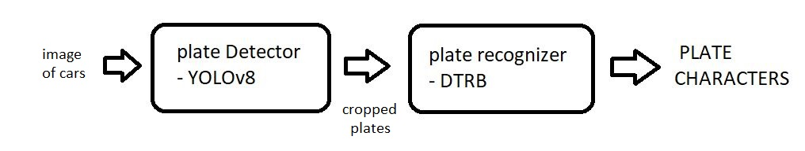
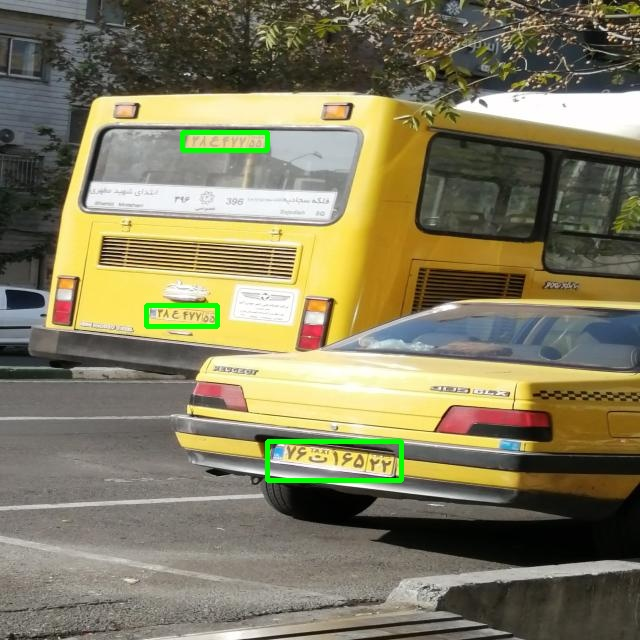
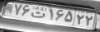
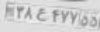
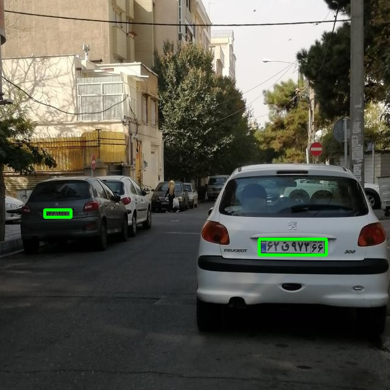
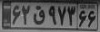
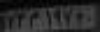
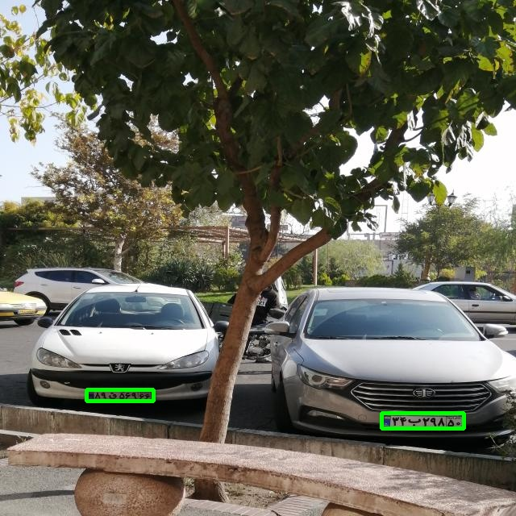
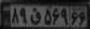
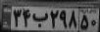

# License Plate Detection + Recognition + Identification + Verification



We are going to use [deep-text-recognition-benchmark](https://github.com/clovaai/deep-text-recognition-benchmark) repository to recognize persian license plate numbers .

## How to install 

```
pip install -r requirements.txt
```

## Download pre-trained weights 


#### [YOLOv8 detector](https://drive.google.com/file/d/1ZBNtQo7AH15ke1Cx43uTuZJqeKTjJ5vM/view?usp=drive_link)

#### [DTRB recognizer](https://drive.google.com/file/d/1hHYkrPvpCIvnqiHxsUX1dmpumjtq9voF/view?usp=drive_link)


## How to use


```
python main.py --recognizer_weights weights\dtrb_recognizer\Dtrb_TPS-ResNet-BiLSTM-Attn_License_Plate_Recognizer.pth --input_image io\input\image3.jpg --threshold 0.5
```

This command will run the main.py file and pass the values for the --recognizer_weights, --input_image, and --threshold arguments as specified in your code. Make sure to navigate to the directory where your main.py file is located before running this command.

---

## Results of license plate verification





|Ground Truth|predicted_labels|confidence score|
|------------|----------------|----------------|
||76t16522|0.9975|
||38e47755|0.9854|


---



|Ground Truth|predicted_labels|confidence score|
|------------|----------------|----------------|
||62q97366|0.9986|
||3m1970|0.1528|


---




|Ground Truth|predicted_labels|confidence score|
|------------|----------------|----------------|
||89q56966|0.9948|
||34b29855|0.7967|


